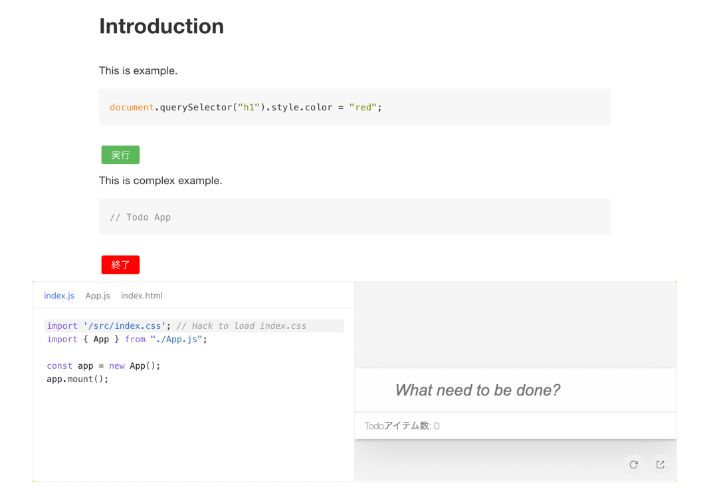

# honkit-plugin-sandpack

A HonKit plugin for [Sandpack](https://sandpack.codesandbox.io/docs/).



## Installation

    npm install honkit-plugin-sandpack

## Usage

Via `book.json`:

```json
{
  "plugins": [
    "sandpack"
  ]
}
```

Integration code with HTML comments.


    <!-- sandpack:{
      "files": {
        "/src/index.js": {
          "path": "example1/index.js"
        },
        "/index.html": {
          "path": "example1/index.html"
        }
      },
      "entry": "/index.html",
      "dependencies": {
        "uuid": "latest"
      }
    } -->
    ```js
    document.querySelector("h1").style.color = "red";
    ```

More complex example.


    <!-- sandpack:{
      "files": {
        "/src/index.js": {
          "prependCode": "import '/src/index.css'; // Hack to load index.css\n",
          "path": "example2/src/index.js"
        },
        "/src/App.js": {
          "path": "example2/src/App.js",
          "active": true
        },
        "/src/index.css": {
          "path": "example2/src/index.css",
          "hidden": true
        },
        "/index.html": {
          "path": "example2/index.html"
        }
      },
      "entry": "/index.html"
    } -->
    ```js
    // Todo App
    ```

For more details, See [example](https://github.com/honkit/honkit-plugin-sandpack/blob/main/public/README.md?plain=1)

## Tests

- [ ] Write How to Tests

## Contributing

1. Fork it!
2. Create your feature branch: `git checkout -b my-new-feature`
3. Commit your changes: `git commit -am 'Add some feature'`
4. Push to the branch: `git push origin my-new-feature`
5. Submit a pull request :D

## License

MIT
